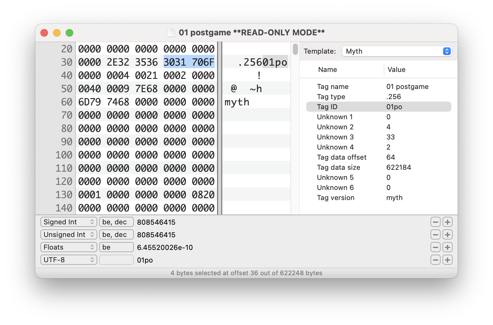
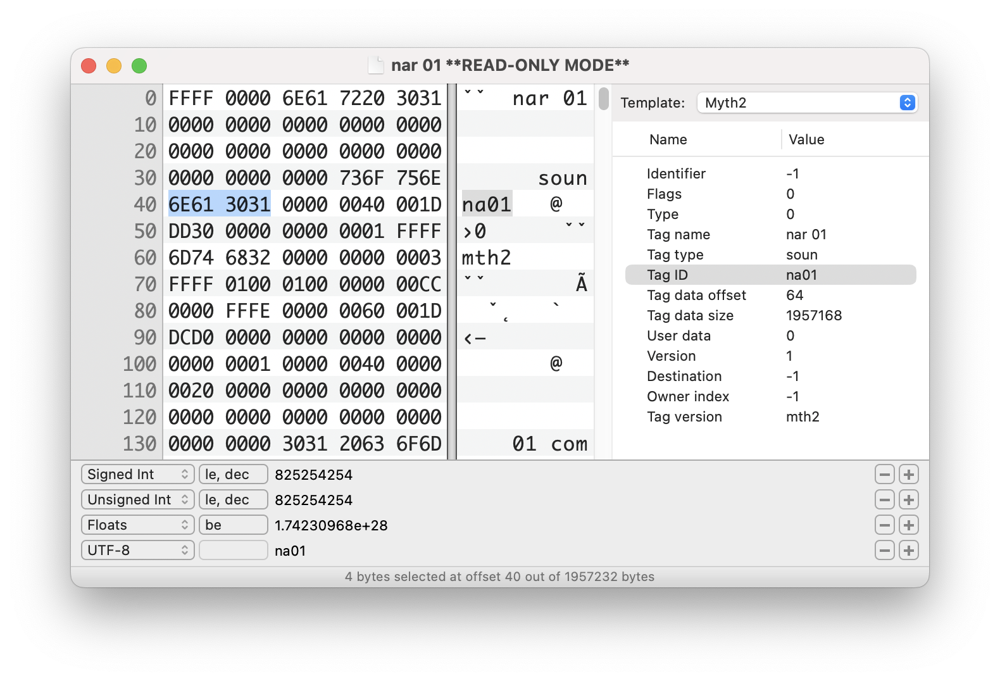

# HexFiend Binary Templates

Basic *[Binary Templates](https://github.com/HexFiend/HexFiend/blob/master/templates/Tutorial.md)* for HexFiend (macOS) that parse the top level *TFL* and *SB* tag header (doesn't show tag specific headers yet). Copy these to `~/Library/Application Support/com.ridiculousfish.HexFiend/Templates`

